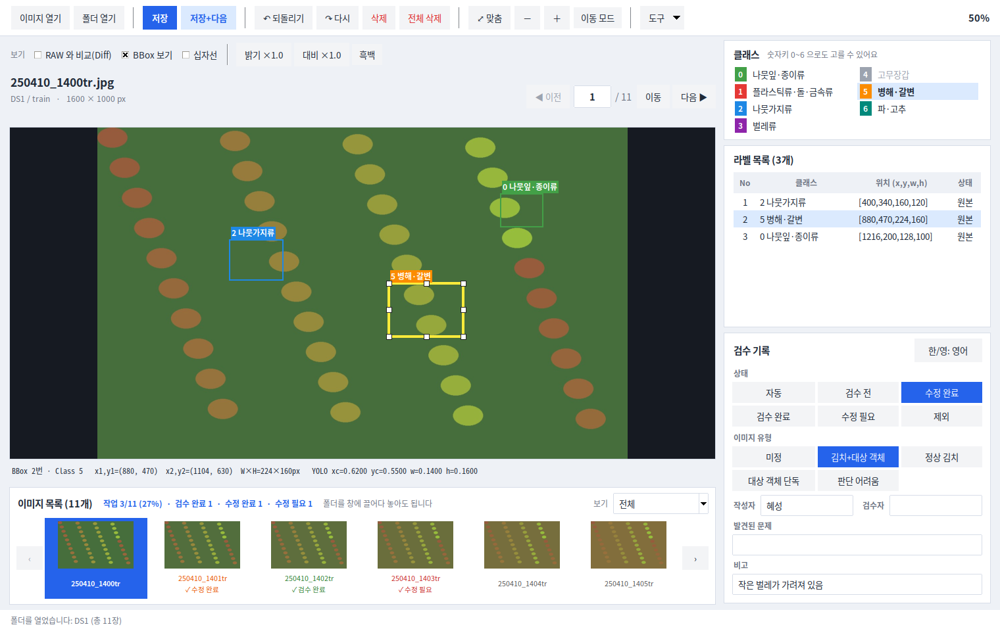

# AI Campus Subject 7
# Kimchi YOLO Labeling Tool

## 1. 프로젝트 소개

본 프로젝트는 조각김치 이물검출용 이미지와 기존 YOLO TXT 를 불러와
BBox 와 Class 를 확인·수정하고 최종 학습데이터를 만드는 라벨링 프로그램입니다.

최종 목표는 교과 8 Object Detection 학습에 사용할 수 있는 검수 완료 YOLO Dataset 을 만드는 것입니다.

> **개발 단계**: 현재 1일차 — 이미지 1장 End-to-End 까지 구현되어 있습니다.
> 이전/다음 이동, Zoom/Pan, 검수 상태 입력 화면, Validation 은 개발 예정입니다.

---

## 2. 프로젝트 주요 기능



*(화면 예시 — 직접 만든 가짜 사진 11장으로 띄운 것이며 회사 데이터가 아닙니다)*

구현됨:

- JPG 이미지 열기, 같은 이름의 기존 YOLO TXT 자동 Load
- **폴더째 열기**: `[폴더 열기]` 버튼 또는 폴더를 창에 끌어다 놓기 → 폴더 안의 사진 전체가 화면 아래 **이미지 목록**에 올라옴 (끌어다 놓기는 `tkinterdnd2` 설치 시)
- **하단 이미지 목록(미리보기)**: 사진을 눈으로 보고 눌러 이동, 현재 사진은 파란 테두리, 사진 아래에 저장 여부(✓)와 검수 상태를 색 글자로 표시
- **상태별 보기**: 이미지 목록 오른쪽 `보기` 에서 미작업 / 검수 전 / 수정 완료 / 검수 완료 / 수정 필요 / 제외만 모아서 보기
- **사진 이동**: 이전/다음 버튼 · `← →` / `A D` / `PageUp PageDown` · 사진 번호 입력(`Ctrl+G`) · 이미지 목록 클릭
- **이어서 시작**: 프로그램을 다시 켜면 마지막으로 보던 폴더와 사진을 자동으로 연다 (`data/work/_session.json`, Git 에 올라가지 않음)
- 4K 이미지 **확대/축소(Zoom)와 화면 이동(Pan)**, 되돌리기/다시 실행(Undo/Redo)
- **BBox 수정**: 안쪽 드래그로 이동, 8개 핸들로 크기 조절, `Shift`+드래그로 겹쳐서 새 BBox, `Esc` 로 취소, 선택한 BBox 좌표 실시간 표시, 전체 삭제
- **RAW 와 비교(Diff)**: 추가(초록)·수정(주황)·삭제(빨강) 표시
- 화면 보조: 십자선, 밝기·대비·흑백 (화면 표시용 — 원본과 저장 라벨은 그대로)
- 기존 BBox 와 Class 표시, BBox 추가 / 삭제, Class 변경
- YOLO TXT 저장(WORK) 및 다시 불러오기(Reload), **저장 후 다음**(`W`)
- RAW 원본 보호 (저장 경로가 RAW 안이면 저장 거부)
- 데이터 조사 (이미지·TXT 개수, 짝, 빈 TXT, Class 분포), **무결성 검증(QA)**
- **저장할 때 검수표(`manifests/dataset_manifest.csv`)에 자동 기록** (파일명, 출처, split, BBox 수, Class, 상태 등)
- **보기 좋은 화면**: 카드형 오른쪽 패널(클래스 / 라벨 목록 / 검수 기록), 색으로 구분되는 버튼, 자주 안 쓰는 기능은 `도구` 메뉴로 정리 (색·글꼴은 `src/ui/theme.py` 한 곳에서 바꿀 수 있음)
- **검수 기록 입력칸**: 상태·이미지 유형은 눌러서 고르는 버튼으로 한 번에 선택, 작성자·검수자·발견된 문제·비고는 입력 (한글은 `한/영` 버튼 또는 한/영 키)
- **라벨 목록 표**: No · 클래스 · 위치 · 상태(원본 / 변경 — 고친 BBox 는 주황색, 이미지 밖·Class 범위 밖 등 이상한 BBox 는 빨간 `⚠ 확인`)
- **한 키 검수**: `Enter` = 이 사진은 끝(저장하고 다음 사진으로, 원본과 같으면 '검수 완료' · 고쳤으면 '수정 완료'), `R` = 수정 필요로 표시하고 이유 쓰기, `N` = 아직 안 한 사진으로 건너뛰기
- **작업 진행 요약**(이미지 목록 제목줄: 작업 3/11 · 검수 완료 · 수정 완료 · 수정 필요)과 **'● 저장 안 됨'** 표시
- **BBox 키보드 조작**: `Tab` 으로 BBox 선택 이동, `Shift`+방향키 1px 이동(`Ctrl` 도 누르면 10px), `H` 로 BBox 숨기기
- **안전 경고**: 원본 라벨에서 읽지 못한 줄이 있으면 이미지 위에 계속 경고하고, 저장하기 전에 한 번 확인 (원본은 항상 그대로). Windows 가 붙이는 BOM 도 읽을 수 있음
- **도움말**: 버튼에 마우스를 올리면 설명 말풍선, `F1` 로 단축키 도움말

개발 예정:

- (현재 계획된 기능은 모두 구현됨)

## 3. 프로젝트 폴더 구조

```text
group_3/
│
├── main.py                       프로그램 시작
├── requirements.txt
├── README.md
│
├── src/
│   ├── settings.py               경로·Class 설정 읽기
│   ├── data_paths.py             RAW / WORK 경로, RAW 보호
│   ├── ui/main_window.py         화면·버튼·마우스 이벤트
│   ├── bbox/bbox_manager.py      BBox 생성·선택
│   ├── manifest/manifest_writer.py  저장할 때 검수표(CSV) 기록
│   ├── yolo/                     YOLO TXT 읽기·쓰기·좌표 변환
│   └── validation/validator.py   데이터 조사
│
├── configs/
│   └── classes.yaml              Class 0~6 설정
│
├── data/                         Git 에 올리지 않음
│   ├── raw/                      회사 제공 원본 (읽기 전용)
│   ├── work/                     작업 중 데이터
│   └── final/                    최종 QA 완료 데이터
│
├── docs/
│   ├── project_baseline.md       팀 공통 기준
│   ├── class_guide.md            Class 기준서
│   ├── bbox_guide.md             BBox 기준서
│   ├── manifest_guide.md         검수표 작성 방법
│   └── day1/                     1일차 산출물·과정 기록
│
├── manifests/
│   ├── dataset_manifest.xlsx     검수표 (팀이 입력하는 틀)
│   └── dataset_manifest.csv      검수표와 같은 19칸의 CSV 머리글
│
├── reports/                      qa_summary.md, test_report.md (작성 예정)
└── tests/
    └── day1_selftest.py          자체 점검
```

---

## 4. 설치

가상환경을 생성합니다.

```bash
python3 -m venv .venv
```

Linux / WSL:

```bash
source .venv/bin/activate
```

Windows:

```text
.venv\Scripts\activate
```

필요한 패키지를 설치합니다.

```bash
pip install -r requirements.txt
```

(Tkinter 가 없으면 WSL/Ubuntu 에서는 `sudo apt install python3-tk` 가 필요합니다.)

---

## 5. 프로그램 실행

```bash
python main.py
```

---

## 6. 기본 사용 순서

1. `data/raw/` 에 회사 제공 데이터(이물검출_학습데이터1, 2)를 복사해 넣습니다.
2. `python main.py` 로 실행하고 **[도구] ▸ [데이터 조사]** 로 개수와 짝을 확인합니다.
3. **[이미지 열기]** 로 사진 1장을 엽니다. 같은 이름의 TXT 가 자동으로 불러와집니다.
   폴더 전체로 시작하려면 왼쪽 **[폴더 열기]** 를 누르거나 폴더를 창에 끌어다 놓습니다. (`data/raw/이물검출_학습데이터1` 처럼 데이터셋 폴더를 열면 `images/train`·`images/val` 의 사진이 모두 목록에 올라옵니다. `data/raw` 밖의 폴더는 저장은 되지만 검수표에는 기록되지 않습니다)
4. 기존 BBox 와 Class 를 확인합니다.
5. 잘못된 BBox 는 삭제하고, 누락된 객체는 드래그로 추가합니다. Class 는 숫자키 0~6 으로 바꿉니다.
6. 판단이 어려운 경우는 임의로 처리하지 않고 REVIEW 로 표시합니다. (`R` 키를 누르면 `상태 = 수정 필요`, `발견된 문제 = REVIEW: ` 가 채워지니 이유 코드를 이어서 쓰고 `Enter`)
   이상 없는 사진은 `Enter` 한 번으로 '검수 완료'를 기록하고 다음 사진으로 넘어갑니다.
7. **[저장]** 으로 저장합니다. (`data/work/` 에 RAW 와 같은 구조로 저장되고, 검수표 CSV 에도 자동으로 기록됩니다)
8. **[도구] ▸ [다시 불러오기]** 로 같은 위치에 복원되는지 확인합니다.

| 조작 | 방법 |
|---|---|
| 새 BBox | 빈 곳을 드래그 (5px 미만·이미지 밖은 만들지 않음). BBox 위에서 새로 그리려면 `Shift`+드래그 |
| 선택 | BBox 클릭 또는 오른쪽 라벨 목록 클릭 (선택하면 핸들 8개와 좌표가 보임) |
| 이동 | 선택·클릭한 BBox 안쪽을 드래그 (이미지 밖으로는 나가지 않음) |
| 크기 조절 | 선택된 BBox 의 흰색 핸들을 드래그 (최소 4px) |
| 취소 | 드래그 도중 `Esc` (드래그 중이 아니면 선택 해제) |
| Class | 숫자키 0~6 또는 Class 목록 (BBox 선택 상태면 그 BBox 의 Class 변경) |
| 삭제 | `Delete` 키 (선택한 BBox) · `[전체 삭제]` (확인창, Undo 가능) |
| 되돌리기 / 다시 | `Ctrl+Z` / `Ctrl+Y` (이동·크기 조절·삭제·전체 삭제 포함) |
| 확대·이동 | 마우스 휠 = 확대/축소, 오른쪽(또는 휠) 버튼 드래그 = 화면 이동, `F` = 화면 맞춤 |
| 화면 이동 모드 | 툴바 `이동 모드` 를 켜면 왼쪽 버튼 드래그로도 화면을 옮김 (끄면 다시 BBox 편집) |
| 사진 이동 | `← →` · `A D` · `PageUp PageDown`, `Ctrl+G` 로 번호 입력, 화면 아래 이미지 목록 클릭 |
| 걸러서 보기 | 이미지 목록 오른쪽 `보기` — 수정 필요 등 상태별로 모아서 이동 |
| 저장 | `Ctrl+S`, 저장하고 다음 사진으로 = `W` 또는 `저장+다음` |
| 빠른 검수 | `Enter` = 이 사진은 끝(저장 + 다음 사진, 상태 자동 기록) · `R` = 수정 필요로 표시하고 이유 쓰기(이유를 쓰고 `Enter`) · `N` = 아직 안 한 사진으로 |
| BBox 키보드 | `Tab` / `Shift+Tab` = BBox 선택 이동 · `Shift+방향키` = 1px 이동(`Ctrl` 도 누르면 10px) · `H` = BBox 숨기기·보이기 |
| 도움말 | `F1` = 단축키 도움말, 버튼에 마우스를 올리면 설명 |
| 비교 보기 | 이미지 위 `보기` 줄의 **RAW 와 비교(Diff)** — 초록 추가 · 주황 수정(회색 점선 = 원래 위치) · 빨강 점선 삭제 |
| 화면 보조 | 같은 줄의 **십자선**, **밝기 / 대비 / 흑백** (화면에만 적용, 저장 라벨은 그대로) |

입력칸(비고 등)에 글자를 치는 동안에는 `W`·`A`·`D`·`F`·`H`·`N`·`R`·`Enter`·숫자 같은 단축키가 동작하지 않습니다.

---

## 7. YOLO Label 형식

TXT 한 줄은 객체 하나를 의미합니다.

```text
class_id x_center y_center width height
```

예:

```text
2 0.7565104167 0.1622685185 0.0473958333 0.0615740741
```

좌표는 pixel 값이 아니라 이미지 크기 대비 0~1 범위의 비율값입니다.

---

## 8. Class 설정

Class 정보는 다음 파일에서 관리합니다.

```text
configs/classes.yaml
```

사용 Class:

- Class 0: 나뭇잎·종이류
- Class 1: 플라스틱류·돌·금속류
- Class 2: 나뭇가지류
- Class 3: 벌레류
- Class 4: 고무장갑 — 현재 사용하지 않음
- Class 5: 병해·갈변
- Class 6: 파·고추

상세한 Class 판단 기준은 다음 문서를 확인합니다.

```text
docs/class_guide.md
```

---

## 9. BBox 작업 기준

BBox 는 객체 외곽에 최대한 밀착하여 작성합니다.

상세한 BBox 기준은 다음 문서를 확인합니다.

```text
docs/bbox_guide.md
```

---

## 10. 데이터 작업 위치

원본 데이터:

```text
data/raw/
```

작업 중 데이터 (RAW 와 같은 폴더 구조, 라벨 TXT 만 저장):

```text
data/work/
```

최종 QA 완료 데이터:

```text
data/final/
```

RAW 데이터는 직접 수정하지 않습니다. 프로그램도 RAW 안에는 저장하지 않습니다.

---

## 11. 작업 상태 확인

900장의 작업 상태는 다음 검수표에서 확인합니다. (이미지 1장 = 1행)

```text
manifests/dataset_manifest.xlsx
```

- 시트 `검수표`: 칸 19개
  - No · 이미지 파일명 · 라벨(TXT) 파일명 · 이미지 유형 · 원본 BBox 수 · 최종 BBox 수 · Class
  - TXT 줄 수 = 화면 BBox 수 · 위치 맞음 · Class 맞음 · 누락 객체 여부
  - 상태 · 발견된 문제 · 작성자 · 검수자 · 검수일 · 비고(수정 내용)
  - 출처 데이터셋 · 원래 split
- 시트 `Class 기준`: Class ID / 이물 종류 / 사용 기준
- 같은 19칸의 CSV 머리글: `manifests/dataset_manifest.csv`

상태는 목록에서 고릅니다.

```text
검수 전 / 검수 완료 / 수정 필요 / 수정 완료 / 제외
```

판단이 어려운 사진(REVIEW)은 `상태 = 수정 필요` + `발견된 문제 = REVIEW: 이유 코드` 로 표시합니다.

작성 방법과 REVIEW 처리, FINAL 조건은 다음 문서를 확인합니다.

```text
docs/manifest_guide.md
```

**프로그램이 [저장]할 때 자동으로 채우는 칸**: No, 이미지·TXT 파일명, 원본/최종 BBox 수, Class, TXT 줄 수 = 화면 BBox 수, 상태(고쳤으면 `수정 완료`), 출처 데이터셋, 원래 split

**사람이 직접 채우는 칸**: 이미지 유형, 위치 맞음, Class 맞음, 누락 객체 여부, 발견된 문제, 작성자, 검수자, 검수일, 비고 (프로그램은 건드리지 않습니다)

---

## 12. QA 결과

최종 라벨 데이터의 품질검사 결과는 다음 파일에서 확인합니다. (작성 예정)

```text
reports/qa_summary.md
```

---

## 13. 프로그램 테스트 결과

라벨링 프로그램 테스트 결과는 다음 파일에서 확인합니다.

```text
reports/test_report.md
```

테스트 단계와 현재 상태:

| 단계 | 상태 |
|---|---|
| Golden Test | 실제 데이터 900장 읽기 전용 점검(짝·Validation·Round-trip)과 자동 시험으로 11/12 확인, 화면 표시는 사람 확인 `미확인` |
| Pilot Test (20~50장) | 미실시 — 사람이 실제 작업 흐름으로 해 보고 기록해야 함 |
| Final Acceptance Test | 미실시 — 900장 검수 완료 후 |

자동 시험은 가짜 데이터로 돌아가며, 한 번에 실행하려면 다음과 같이 합니다.

```bash
python tests/run_all.py                # 모든 시험을 한 번에 (약 1분)
python tests/day1_selftest.py          # 1일차 자체 점검만
```

---

## 14. FINAL Dataset

최종 QA 가 완료된 데이터는 다음 위치에 정리합니다. (작성 예정)

```text
data/final/
├── images/
└── labels/
```

FINAL 데이터는 교과 8 Object Detection 학습에 사용합니다.

---

## 15. 주의사항

- `data/raw/` 원본은 수정하지 않습니다.
- 실제 JPG 와 TXT 전체 데이터는 GitHub 에 업로드하지 않습니다.
- REVIEW 상태의 데이터는 FINAL 에 포함하지 않습니다.
- 이미지와 TXT 의 기본 파일명은 동일해야 합니다.
- 수정 후 반드시 저장과 Reload 를 확인합니다.
- 최종 제출 전 Validation 을 실행합니다.
- 실제 데이터를 캡처한 화면은 공개 저장소에 올리지 않습니다.
