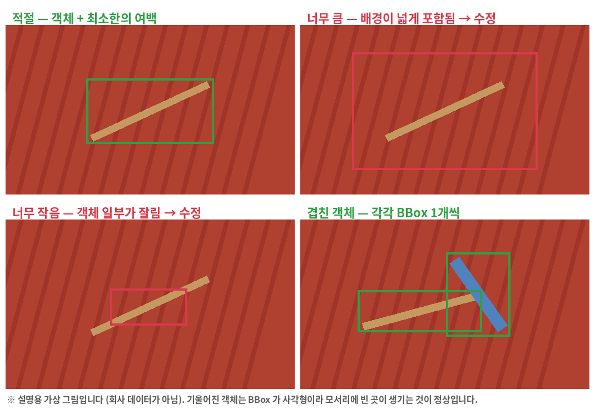

# Bounding Box Labeling Guide

> **어디부터 어디까지 사각형으로 표시할 것인가**를 정한 문서입니다. 작업자마다 BBox 크기와 위치가 다르면
> 같은 객체를 라벨링해도 데이터 품질이 떨어지므로, 팀이 하나의 기준을 사용합니다.
> 이 기준은 900장 검수와 교차검수에 그대로 적용합니다. (Class 기준: [class_guide.md](class_guide.md), 검수표 작성: [manifest_guide.md](manifest_guide.md))

| 항목 | 내용 |
|---|---|
| 적용 대상 | 이물검출 900장 (이미지 1장 = TXT 1개, 기존 YOLO TXT 를 **검수·보정**) |
| 좌표 | 프로그램은 BBox 를 **원본 이미지 픽셀 좌표**로 다루고, 저장할 때 YOLO 비율값으로 바꿉니다 |
| 담당 | BBox / 좌표 — 김석범, 검수 기준 문서 — 강동연 |

## 공통 원칙

- BBox 는 객체의 실제 외곽에 최대한 밀착하여 작성합니다.
- 객체와 관계없는 배경을 지나치게 많이 포함하지 않습니다.
- 객체 일부가 가려져 있어도 보이는 범위를 기준으로 판단합니다.
- 하나의 BBox 에는 가능한 한 하나의 객체만 포함합니다.
- 기존 BBox 가 기준에 맞으면 **고치지 않고** 검수 완료로 둡니다. 맞지 않을 때만 고칩니다.
- 판단이 어려우면 임의로 처리하지 않고 REVIEW 로 보냅니다.



---

## 1. 기본 BBox 작성 기준

객체의 외곽에 최대한 밀착하여 BBox 를 작성합니다.

| 모양 | 판정 | 처리 |
|---|---|---|
| 객체 + 넓은 배경 (여백이 허용치보다 큼) | 너무 큼 | 수정 |
| 객체 전체 + 최소한의 배경 (여백이 허용치 이내) | **적절** | 검수 완료 (수정 없음) |
| 객체 일부가 BBox 밖으로 나감 (잘림) | 너무 작음 | 수정 |

### 여백 허용치 (확정 기준)

여백 = 객체의 가장자리와 BBox 의 변 사이 거리 (**원본 이미지 픽셀** 기준, 네 변 각각).

| 객체 크기 (BBox 의 짧은 변) | 변마다 허용하는 여백 |
|---|---|
| 40px 미만 (작은 객체) | **4px 이내** |
| 40px ~ 200px | **짧은 변의 10% 이내** (예: 100px 객체 → 10px 이내) |
| 200px 초과 (큰 객체) | **20px 이내** |

- 객체가 **BBox 밖으로 4px 이상** 나가 있으면 "너무 작음"이므로 수정합니다.
- 허용치 안의 차이(몇 픽셀 어긋남)는 고치지 않습니다. 같은 사진을 사람마다 다시 고치지 않기 위한 기준입니다.
- 기울어진 객체는 BBox 가 사각형이라 모서리에 빈 곳이 생기는 것이 정상입니다. 가장 바깥 점을 기준으로 잡습니다.
- 참고(실제 라벨 4399개 집계): BBox 짧은 변의 중앙값은 약 150px, 5% 지점이 약 57px, 최소 9px 이었습니다.
  따라서 대부분의 객체는 위 표의 두 번째 줄(10%, 약 6~20px)에 해당합니다.

---

## 2. 객체가 이미지 경계에 걸린 경우

객체 일부가 이미지 밖으로 나간 경우에는 화면에 실제로 보이는 부분을 기준으로 BBox 를 작성합니다.

예: 이미지 오른쪽 밖으로 일부가 잘린 나뭇가지 → 보이는 부분까지만 BBox 작성

(프로그램은 BBox 가 이미지 밖으로 나가지 않도록 자동으로 이미지 경계에서 잘라 줍니다. 이미 밖으로 나간 기존 BBox 는 목록에 빨간 `⚠ 확인` 으로 표시됩니다.)

---

## 3. 객체가 서로 겹친 경우

두 객체가 서로 겹쳐 있어도 각각을 구분할 수 있다면 별도의 BBox 를 작성합니다. (BBox 끼리 겹쳐도 됩니다)

예: 나뭇가지 + 플라스틱 조각 → 나뭇가지 BBox 1개 + 플라스틱 BBox 1개

구분이 안 되면 `object_separation_ambiguous` 로 REVIEW 합니다.

---

## 4. 객체가 매우 작은 경우

객체가 작더라도 Class 를 식별할 수 있고 실제 검출 대상이면 BBox 를 작성합니다.

단, 점이나 얼룩처럼 객체 여부를 판단하기 어려우면 `too_small_to_identify` 로 REVIEW 처리합니다.
(프로그램은 원본 이미지 기준 **4px 미만**의 BBox 는 만들지 않고, 그보다 작은 기존 BBox 는 `너무 작음` 으로 경고합니다.)

---

## 5. 객체 일부가 가려진 경우

객체 일부가 김치나 다른 객체에 가려져 있어도 Class 를 식별할 수 있다면 보이는 범위를 기준으로 BBox 를 작성합니다.

Class 를 식별하기 어렵다면 `occlusion_ambiguous` 로 REVIEW 처리합니다.

---

## 6. 하나의 객체를 여러 BBox 로 나누지 않습니다

하나의 객체는 원칙적으로 하나의 BBox 로 작성합니다.

예: 하나의 긴 나뭇가지 → BBox 1개 (잘린 것처럼 보인다고 BBox 2개로 나누지 않음)

단, 실제로 서로 떨어진 별개의 객체라면 각각 BBox 를 작성합니다.
같은 객체를 BBox 2개로 겹쳐 그린 기존 라벨(중복 BBox)은 하나만 남기고 지웁니다. (Validation 의 `DUPLICATE_BOX` 경고로도 찾을 수 있습니다)

---

## 7. 판단이 어려운 경우

BBox 범위나 객체 구분이 애매하면 임의로 결정하지 않습니다.

```text
상태 = 수정 필요
발견된 문제 = REVIEW: 이유 코드
비고(수정 내용) = 무엇이 애매한지 한 줄 설명
```

이유 코드 ([manifest_guide.md](manifest_guide.md) §3 과 같음):

| 코드 | 뜻 | 주로 쓰는 경우 |
|---|---|---|
| `bbox_boundary_ambiguous` | BBox 경계가 애매함 | 객체 가장자리가 흐려서 여백 허용치를 판단하기 어려움 |
| `object_separation_ambiguous` | 겹친 객체를 나누기 어려움 | BBox 를 1개로 할지 2개로 할지 모름 |
| `too_small_to_identify` | 너무 작아서 식별 어려움 | 점·얼룩과 객체의 구분이 안 됨 |
| `occlusion_ambiguous` | 가려져서 판단 어려움 | 가려진 부분 때문에 Class 나 범위를 모름 |
| `class_ambiguous` | Class 를 정하기 어려움 | ([class_guide.md](class_guide.md) 참고) |

코드에 없는 경우는 `REVIEW: Class 4 발견` 처럼 짧게 직접 적습니다. (Class 4 는 삭제하지 않고 이렇게 표시)

REVIEW 는 교차검수자가 확인하고 2명 이상 합의로 정리합니다. 해결되면 고쳤으면 `수정 완료`, 그대로면 `검수 완료` 로 바꾸고 `발견된 문제` 칸은 지우지 않습니다.
(미처리 REVIEW 는 FINAL 로 넘기기 전에 **0건**이어야 합니다.)

---

## 8. 프로그램에서 작업하는 방법

| 하고 싶은 일 | 방법 |
|---|---|
| 기존 BBox 가 맞다 | 수정 없이 `Enter` (검수 완료 후 다음 사진) |
| BBox 를 옮기거나 크기를 바꾼다 | BBox 안쪽을 끌면 이동, 흰 핸들(8개)을 끌면 크기 조절. `Shift+방향키` 로 1px 이동(`Ctrl` 도 누르면 10px), 드래그 중 `Esc` 로 취소 |
| 새 BBox 를 추가한다 | Class 를 고른 뒤(`0`~`6`) 빈 곳을 드래그 (확대한 상태에서도 가능) |
| 잘못된 BBox 를 지운다 | 선택 후 `Delete` (이 사진의 BBox 전부는 [전체 삭제]) |
| 경계를 정밀하게 맞춘다 | 마우스 휠로 확대, 십자선 보기를 켠다 |
| 내가 무엇을 고쳤는지 본다 | [RAW 와 비교(Diff)] — 추가·수정·삭제를 색으로 구분 |
| 애매하다 | `R` 로 `수정 필요` 표시 후 `발견된 문제` 에 `REVIEW: 이유 코드` |
| 되돌린다 / 저장한다 | `Ctrl+Z` / `Ctrl+S` (저장 후 다음 사진은 `W`) |

전체 단축키는 프로그램에서 `F1` 을 누르면 볼 수 있습니다. (원본 RAW 는 수정되지 않고 `data/work/` 에 저장됩니다)

---

## 작업 흐름

```text
객체 확인
        ↓
객체 외곽 확인
        ↓
기존 BBox 가 §1 여백 허용치 안인가?
   ├ 예 → 수정 없이 검수 완료
   └ 아니오 → 배경을 최소화하여 BBox 를 밀착해 고침 → Class 확인 → 저장 (수정 완료)
        ↓
애매하다 → 임의로 확정하지 않음 → REVIEW → 교차검수
```

## 검수자가 확인하는 것 (교차검수)

- [ ] 모든 객체에 BBox 가 있는가 (작은 객체 누락 없음)
- [ ] 여백이 허용치 이내인가, 객체가 잘리지 않았는가
- [ ] 한 객체에 BBox 가 둘 이상 겹쳐 있지 않은가 (중복)
- [ ] 겹친 객체가 각각 따로 표시되어 있는가
- [ ] Class 가 맞는가, Class 4 가 남아 있지 않은가 (있으면 REVIEW)
- [ ] 하루가 끝나기 전에 전체 Validation 이 오류 0건인가

## 결정 사항

- "너무 크다"의 기준(객체 둘레 여백 허용치): **§1 표** (작은 객체 4px · 중간 짧은 변의 10% · 큰 객체 20px)
- GOOD / BAD 예시: 위의 그림 (설명용 가상 그림). 실제 사진의 예시를 쓰려면 회사 데이터이므로 **공개 저장소에 올리지 않고** 팀 내부 자료로만 보관합니다.
- 팀에서 이 값을 바꾸기로 하면 이 문서의 §1 표만 고치고, 바꾼 날짜와 이유를 아래에 적습니다.

| 날짜 | 바꾼 내용 | 이유 |
|---|---|---|
| 2026-10-07 | 여백 허용치 수치 확정 (4px / 10% / 20px), 이유 코드 5개 통일, 프로그램 작업 방법과 검수 체크리스트 추가 | 제출용 정리 |
